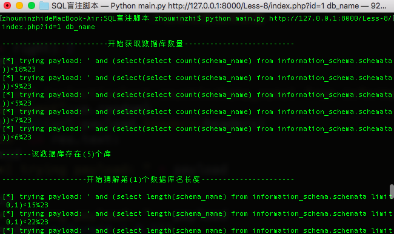
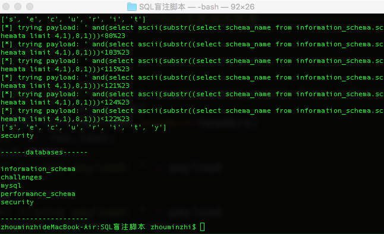
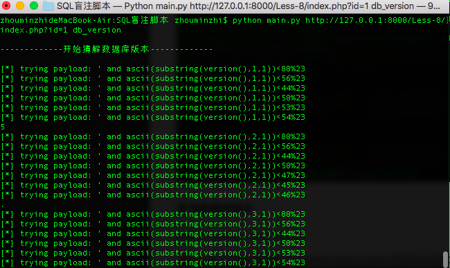
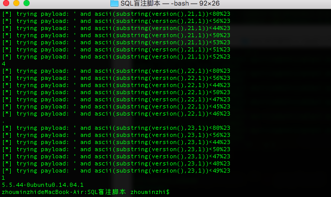
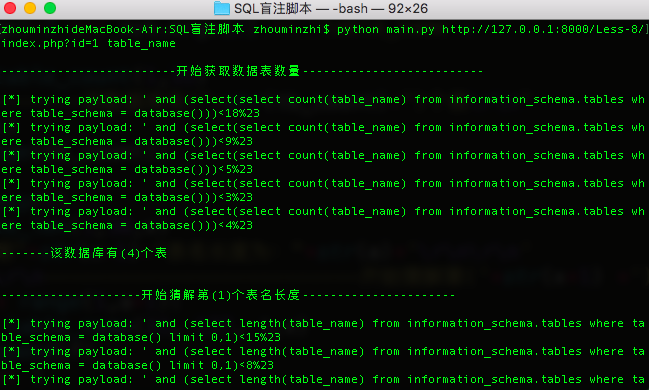
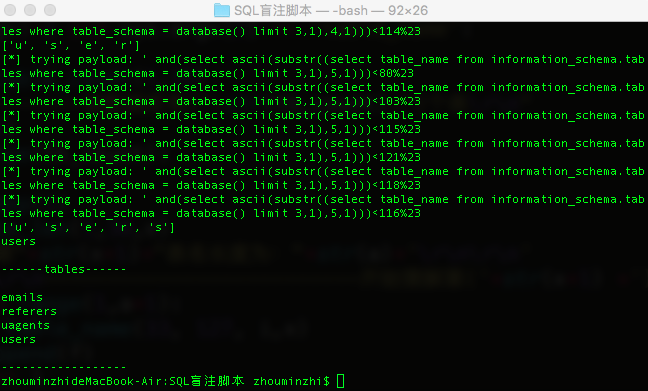

# 使用

#### 查询数据库
python main.py url db_name

#### 查询数据库版本
python main.py url db_version

#### 查表

- 如果要查其他数据库，更改main.py的53行中的database()
- database() - > security

python main.py url table_name

代码写得很烂，学习是一个过程。

安慰自己：大佬也是从这么烂的代码一路过来的